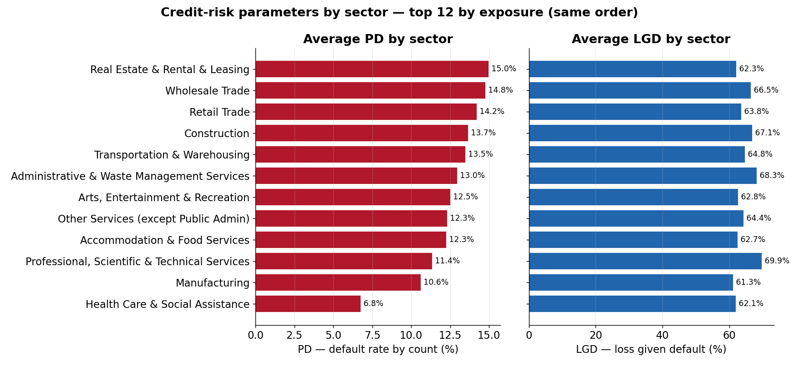
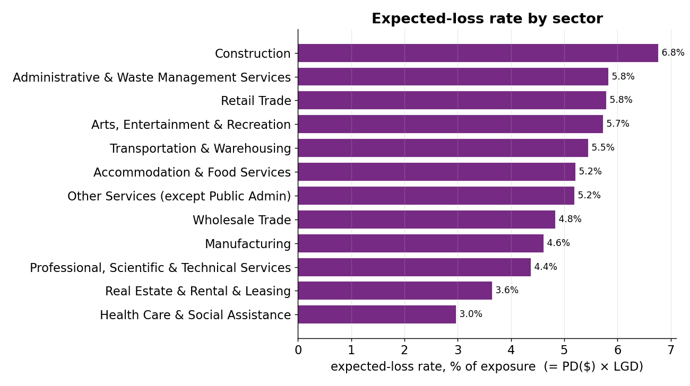
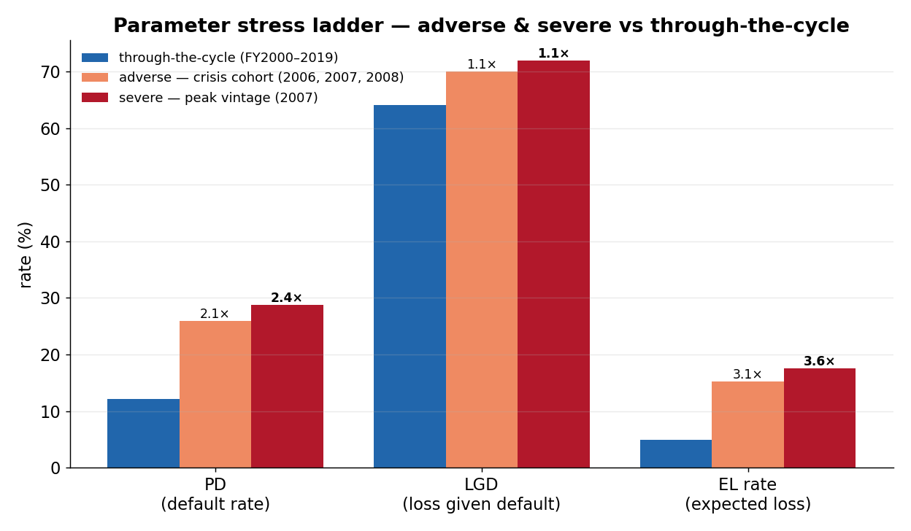

# Commercial Portfolio Monitor — SBA 7(a) real data

> Extract the **average PD, LGD, EAD and Expected Loss** from ~1.09M real U.S.
> SBA 7(a) small-business loans (FY2000–2019, ~$288B approved) — the
> loss-experience assumptions a credit deal is priced on and a provision /
> capital model is calibrated against — broken down **by sector, by product, and
> stressed through the 2008 downturn**.

This is **small-business (SME) lending** data. The four parameters below are
**realised, through-the-cycle** values read straight off loan outcomes (the
FY2000–2019 window deliberately spans the 2008 crisis), reconciling by the
identity **EL rate = PD($) × LGD**. They are *observed* anchors, **not** the
output of a fitted rating model — see [Scope & honesty](#scope--honesty).

---

## Where everything lives

Every number and chart below is committed, regenerated by the pipeline — no run needed:

| Output | Path |
|---|---|
| 📄 One-page monitoring pack (parameters are **§10**) | [outputs/reports/report.md](outputs/reports/report.md) |
| 📋 Parameter tables (overall, by sector/product/size, stress) | [outputs/tables/09_*.csv](outputs/tables/) |
| 📊 Charts | [outputs/charts/](outputs/charts/) |
| 📓 Notebooks (00–05) | [notebooks/](notebooks/) |

```bash
pip install -r requirements.txt
python -m src.run_pipeline      # → outputs/tables + outputs/reports/report.md
python tools/make_figures.py    # → outputs/charts/*.png
pytest                          # fast tests on a synthetic fixture
```

---

## The four parameters at a glance

Portfolio averages across the whole funded book ([09_credit_risk_parameters.csv](outputs/tables/09_credit_risk_parameters.csv)):

| Parameter | Average | Basis |
|---|---:|---|
| **PD** — probability of default (obligor-weighted) | **12.2%** | charged-off loans ÷ funded loans |
| **PD** — exposure-weighted ($) | **7.7%** | defaulted EAD ÷ total EAD |
| **LGD** — loss given default (gross / whole-loan) | **64.0%** | charge-off $ ÷ defaulted EAD |
| **LGD** — net of SBA guarantee (lender-retained, indicative) | **17.2%** | LGD × (1 − 73% guaranteed) |
| **EAD** — exposure at default (avg per loan) | **$264,769** | gross approval |
| **Expected-loss rate** — EL ÷ exposure | **4.9%** | PD($) × LGD |
| **Expected loss per loan** | **$13,032** | charge-off $ ÷ funded loans |

Total realised loss ≈ **$14.2B** on $287.8B of approvals.

---

## 1. Average PD / LGD / EAD / EL by sector

Top 10 sectors by exposure ([09_…by_industry.csv](outputs/tables/09_credit_risk_parameters_by_industry.csv) has all 21):

| Sector (NAICS) | PD | LGD | Avg EAD | **EL rate** |
|---|---:|---:|---:|---:|
| Accommodation & Food Services | 12.3% | 62.7% | $382,427 | **5.2%** |
| Retail Trade | 14.2% | 63.8% | $253,028 | **5.8%** |
| Manufacturing | 10.6% | 61.3% | $345,255 | **4.6%** |
| Health Care & Social Assistance | 6.8% | 62.1% | $338,115 | **3.0%** |
| Other Services | 12.3% | 64.4% | $232,224 | **5.2%** |
| Professional, Scientific & Technical | 11.4% | 69.9% | $194,171 | **4.4%** |
| Wholesale Trade | 14.8% | 66.5% | $308,391 | **4.8%** |
| Construction | 13.7% | 67.1% | $162,768 | **6.8%** |
| Arts, Entertainment & Recreation | 12.5% | 62.8% | $313,625 | **5.7%** |
| Administrative & Waste Management | 13.0% | 68.4% | $152,392 | **5.8%** |

PD and LGD shown together (same sectors, same order, so they read side by side):



PD and LGD move **somewhat independently** — Construction has a high PD (13.7%)
*and* a high LGD (67.1%) → the worst EL; Health Care has a low PD (6.8%) so the
lowest EL despite an average LGD. That is exactly why a price needs both.

---

## 2. By product (facility type) and by loan size

**By product.** This dataset has **no residential mortgage** product and **no
labelled commercial-property** field — it is SME lending throughout. "Product"
is a *use-of-proceeds* facility type derived from the data: export subprogram →
trade finance; revolving flag → working-capital line; loan term >15y → real-estate
purpose (a labelled **proxy** — only real estate carries SBA maturities that
long); else general SME term loan ([09_…by_product.csv](outputs/tables/09_credit_risk_parameters_by_product.csv)):

| Product (facility type) | Loans | PD | LGD | Avg EAD | **EL rate** |
|---|---:|---:|---:|---:|---:|
| Commercial property / real-estate term loan *(proxy: term >15y)* | 144,669 | 3.7% | 52.9% | $875,305 | **1.9%** |
| Trade & export finance | 7,500 | 11.2% | 60.4% | $936,121 | **4.6%** |
| General SME term loan | 615,115 | 13.1% | 64.2% | $217,619 | **7.1%** |
| Working-capital line (revolving) | 319,735 | 14.5% | 87.0% | $63,483 | **9.4%** |

Property-secured lending is safest (EL 1.9%); a revolving working-capital line is
riskiest per dollar (EL 9.4%, LGD 87% — drawn toward the limit at default).

**By collateral & structure** ([09_…by_structure.csv](outputs/tables/09_credit_risk_parameters_by_structure.csv)) — *secured* = registered collateral, the **PPSR-equivalent**:

| Cut | Segment | PD | LGD | **EL rate** |
|---|---|---:|---:|---:|
| Collateral | **Secured (PPSR-equivalent)** | 8.8% | 62.9% | **3.4%** |
| Collateral | Unsecured | 14.5% | 64.8% | **7.5%** |
| Loan structure | Term loan | 11.3% | 61.4% | **4.6%** |
| Loan structure | Revolving line of credit | 14.4% | 86.9% | **8.6%** |

**By loan size — the pricing curve** ([09_…by_size_band.csv](outputs/tables/09_credit_risk_parameters_by_size_band.csv)). Small tickets default ~5× more often *and* lose more per dollar:

| Size band | PD | LGD | Avg EAD | **EL rate** |
|---|---:|---:|---:|---:|
| ≤ $50k | 16.1% | 83.3% | $27,372 | **13.5%** |
| $50k–150k | 11.0% | 72.9% | $103,701 | **8.0%** |
| $150k–350k | 9.1% | 66.9% | $251,442 | **6.1%** |
| $350k–1m | 8.2% | 60.3% | $602,830 | **4.9%** |
| $1m–2m | 7.3% | 57.4% | $1,429,610 | **4.2%** |
| > $2m | 2.9% | 52.5% | $3,116,693 | **1.5%** |

---

## 3. Expected loss

**Expected loss = PD × LGD × EAD.** As a portfolio total it equals the realised
charge-off on defaulted loans, **≈ $14.2B**, i.e. an **EL rate of 4.9%** of
exposure — which reconciles exactly as `PD($) 7.7% × LGD 64.0%`. Per funded loan,
that averages **$13,032**.

For pricing this is the **minimum loss margin** a deal must clear before funding
cost, opex and a capital charge. It varies ~9× across sectors:



- **Highest:** Construction (6.8%), Retail Trade (5.8%), Admin & Waste Mgmt (5.8%).
- **Lowest:** Health Care (3.0%) — low PD carries through to low EL.
- For **provisioning (ECL)**, these through-the-cycle figures are the historical
  anchor a point-in-time, forward-looking ECL is overlaid on.

---

## 4. Stress test — downturn PD / LGD / EL

The SBA data (FY2000–2019) contains **one** macro downturn — the 2008 financial
crisis — but it supports a **two-level stress ladder** read straight off the
realised cohorts (both are fully seasoned, so near-final):

- **Adverse** = the crisis cohort pooled (2006–08)
- **Severe** = the single worst vintage, the peak of the crisis (**2007**, auto-detected)

Both **PD and LGD rise**, so EL rises multiplicatively
([09_…stress.csv](outputs/tables/09_credit_risk_parameters_stress.csv)):

| Parameter | Through-the-cycle | Adverse (2006–08) | × | Severe (2007) | × |
|---|---:|---:|---:|---:|---:|
| PD — default rate (obligor-weighted) | 12.2% | 25.9% | **2.1×** | 28.8% | **2.4×** |
| PD — default rate (exposure-weighted) | 7.7% | 21.9% | **2.8×** | 24.4% | **3.2×** |
| LGD — loss given default | 64.0% | 70.0% | **1.1×** | 71.9% | **1.1×** |
| EAD — avg exposure per loan | $264,769 | $154,065 | 0.6× | $142,500 | 0.5× |
| **EL rate — expected loss / exposure** | **4.9%** | **15.3%** | **3.1×** | **17.6%** | **3.6×** |



The headline: **expected loss roughly triples** in a downturn (4.9% → 15.3%
adverse → 17.6% severe), driven mostly by PD doubling with LGD adding ~9–12% on
top. (EAD *falls* — crisis cohorts were smaller loans — so it is not a stress
driver; exposure is fixed at approval.)

> **Two stress views in the repo, by design.** This *parameter* stress (PD/LGD/EAD/EL,
> whole-book TTC baseline) sits alongside the limit-linked **charge-off-rate
> stress** in report §9 / [08_stress_scenario.csv](outputs/tables/08_stress_scenario.csv),
> which uses a *seasoned-only* baseline (13.5%) so it can be re-tested against the
> risk-appetite charge-off limit. Same crisis, two lenses — pricing/ECL inputs
> here, appetite-limit breach there.

---

## How the parameters are defined

All four reuse the same primitives as the charge-off and stage-proxy tables, so
they reconcile. SBA FOIA data is outcome-level (one final status per loan), with
no amortising balance — so exposure is measured at approval.

| Parameter | Definition | Note |
|---|---|---|
| **PD** | `default = LoanStatus == CHGOFF`; rate = charged-off ÷ total | A *lagging, realised* default (charge-off), not the APS 220 90+DPD/UTP reference — so it **understates** how many loans ever breached. |
| **LGD** | charge-off $ ÷ exposure of defaulted loans | Gross / whole-loan. Net-of-guarantee applies the ~73% SBA guaranteed share (**indicative**). |
| **EAD** | `grossapproval` | Origination exposure proxy — slightly *overstates* balance at default for amortised loans. |
| **EL** | PD × LGD × EAD ( = realised charge-off $ ) | EL rate = charge-off $ ÷ total exposure = the dollar charge-off rate. |

### Scope & honesty

These are *realised, extracted* parameters — **not** a fitted obligor-level
rating model. There is no scorecard and no PD prediction here, so there is no
model-performance / backtesting layer (that lives in the sister modelling repos).
"Commercial property" is a labelled **term-based proxy**, not a product field.
Full assumptions: [docs/assumptions.md](docs/assumptions.md) · methodology:
[docs/methodology.md](docs/methodology.md).

---

## Also in this repo (portfolio monitoring)

Beyond the parameters, the pipeline produces a full APRA/APS 220-style monitoring
pack — see [outputs/reports/report.md](outputs/reports/report.md):

- **Concentration** — HHI + top-N by industry / state / lender (industry HHI 0.10, *Moderate*).
- **Charge-off & vintage cohorts** — by industry / size / vintage; the 2007 cohort charged off ~29% (~5× calm years).
- **Risk appetite & RAG dashboard** — config-driven limits with owners, breach actions, amber/red status.
- **Early-warning segments**, **problem-exposure layer** (DELINQ/PSTDUE/IN-LIQUIDATION), **leading-vs-lagging** views.

### How this maps to the APRA / Basel framework

| Requirement | Where it's evidenced |
|---|---|
| Risk parameters (PD / LGD / EAD / EL) | **realised** parameters as pricing & ECL inputs, by sector/product/size + stress — [src/credit_parameters.py](src/credit_parameters.py), report §10 |
| Default definition (APS 220) | `default = charge-off`, labelled lagging vs 90+DPD/UTP — [src/problem_exposure.py](src/problem_exposure.py) |
| Concentration limits (APS 220 para 35) | HHI + top-N, tied to appetite limits — [src/concentration.py](src/concentration.py) |
| Risk appetite + RAG (APS 220 / APG 220) | config-driven limit register + board dashboard — [config.yaml](config.yaml), [src/risk_appetite.py](src/risk_appetite.py) |
| Stress → limits (APS 220 para 73) | crisis-multiplier scenario re-tested against appetite — [src/stress.py](src/stress.py) |
| Pillar 3 (APS 330) | concentration / credit-quality feed an APS 330-**style** table (format only) — [src/report.py](src/report.py) |
| Out of scope (by design) | IFRS 9 staging, monthly transition matrices, fitted rating models — sister repos |

---

## Repo layout

```
config.yaml              business parameters (universe, size bands, products, limits, stress)
src/
  data_loader.py         read + clean the SBA CSVs (dates, status codes, NAICS → sector)
  base_table.py          one row per loan + derived fields (vintage, size, product_type, default flag)
  credit_parameters.py   realised PD / LGD / EAD / EL — overall, sector, product, structure, stress
  concentration.py       HHI + top-N by industry / state / lender
  chargeoff.py           charge-off rates by industry / size band / vintage
  vintage.py             cumulative charge-off cohort curves
  transitions.py         loan-age transition view
  early_warning.py       elevated-risk segment flags
  problem_exposure.py    pre-charge-off problem-exposure layer (DELINQ/PSTDUE/LIQUID)
  risk_appetite.py       appetite + limit framework, RAG dashboard, actions
  leading.py             leading-vs-lagging map, origination mix trend, vintage-over-vintage
  stress.py              crisis-multiplier charge-off scenario tested against the limits
  report.py              board dashboard, APS 330-style table, PD/LGD/EAD/EL block, Markdown pack
  charts.py              matplotlib chart helpers
  pipeline.py            orchestrates everything → outputs/
  run_pipeline.py        CLI entry point (python -m src.run_pipeline)
tools/make_figures.py    regenerate README charts into outputs/charts/
notebooks/               00–05, each with a plain-English summary + one results table
outputs/                 committed snapshots: tables/ (incl. 09_credit_risk_parameters*), charts/, reports/
docs/                    data dictionary, methodology, assumptions, governance
tests/                   fast unit tests on a synthetic fixture (no raw data needed)
```

---

## Data sources & provenance

- **Source:** U.S. Small Business Administration open data ([data.sba.gov](https://data.sba.gov)) — the **7(a) FOIA** loan-level dataset (CSV).
- **Files:** `foia-7a-fy2000-fy2009-*.csv` and `foia-7a-fy2010-fy2019-*.csv` (approval FY2000–2019), plus the official data dictionary.
- **Compliance:** SBA FOIA data is public / U.S. Government and free to use. The large raw CSVs are **gitignored** — download them and drop them in `data/input/`. Only small output snapshots, charts, and the report are committed.
- **Scope:** 7(a) program only. The 504 FOIA dataset can be added with no code change — any `foia-7a-*.csv` in `data/input/` is picked up automatically.

---

## Related projects

- **Freddie Mac mortgage monitor** — full IFRS 9 staging, monthly transition matrices, roll rates and ECL run-out on a monthly performance panel, plus *fitted* PD models (the model-performance / backtesting layer).
- **Residential mortgage credit-risk repo** — loan-level mortgage default modelling on public data (consumer counterpart to this commercial book).

---

_Built with pandas + matplotlib. Parameter-extraction & monitoring outputs only — not regulated disclosure or credit advice._

## License

Released under the MIT License — free to read, run, and reuse with attribution.
