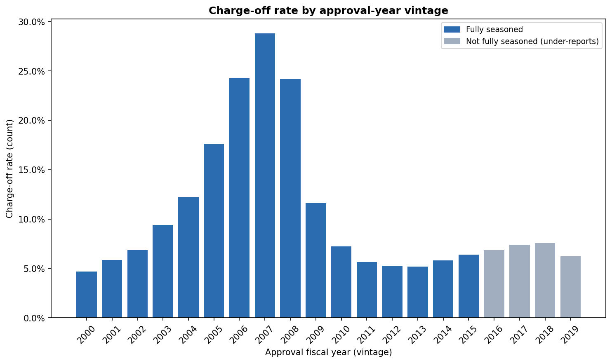
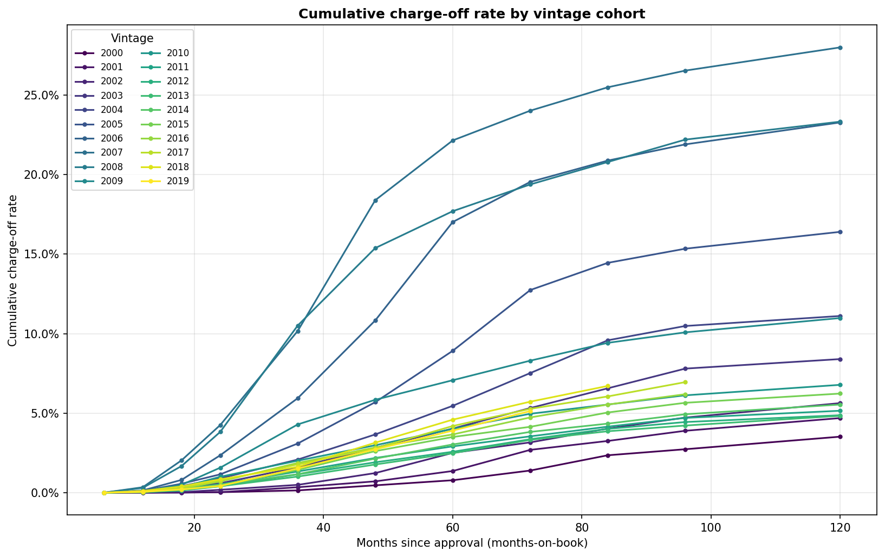

# Commercial Portfolio Monitor — SBA 7(a) real data

> Commercial portfolio monitoring on **real SBA small-business loan data** —
> industry/state concentration (HHI, top-N), charge-off rates and vintage cohort
> curves, and early-warning segmentation.

This project monitors a real, public, **commercial** lending book: ~1.09M U.S.
Small Business Administration **7(a)** loans (approval fiscal years 2000–2019,
~$288B of gross approvals). It is deliberately simple and interpretable —
pandas aggregations, clear definitions, one results table per notebook — and
its strength is **concentration and charge-off cohort analytics on genuine
commercial loans**.

SBA data is outcome-level (one final status per loan), not a monthly grade
panel, so this repo does a *coarse* performing-vs-defaulted view. Full IFRS 9
staging, monthly transition matrices and ECL live in the companion **Freddie Mac
mortgage monitor** (see [Related projects](#related-projects)) — that boundary is
intentional and not duplicated here.

---

## See it in 30 seconds

No download or run needed — everything below is committed real output:

- 📄 **[Monitoring pack report](outputs/report.md)** — the one-page credit-committee summary.
- 📊 **[Charts](outputs/charts/)** — concentration, charge-off, vintage cohort curves.
- 📋 **[Result tables](outputs/tables/)** — one CSV per analysis step.
- 📓 **Notebooks** — [00 Load & clean](notebooks/00_load_and_clean.ipynb) ·
  [01 Base table](notebooks/01_monitoring_base_table.ipynb) ·
  [02 Concentration](notebooks/02_concentration.ipynb) ·
  [03 Charge-off & vintage](notebooks/03_chargeoff_and_vintage.ipynb) ·
  [04 Transitions & early warning](notebooks/04_transitions_and_early_warning.ipynb) ·
  [05 Report](notebooks/05_monitoring_report.ipynb)

To reproduce locally:

```bash
pip install -r requirements.txt
# place the SBA 7(a) FOIA CSVs in data/input/  (see Data sources & provenance)
python -m src.run_pipeline          # writes outputs/tables, outputs/charts, outputs/report.md
python -m src.build_notebooks       # (optional) rebuild + execute notebooks 00–05
pytest                              # fast unit tests on a synthetic fixture
```

---

## What this produces

**Headline read (real output, FY2000–2019):**

| Metric | Value |
|---|---|
| Funded 7(a) loans | 1,087,019 |
| Total gross approval | $287.8B |
| Charge-off rate (by count / by $) | 12.2% / 4.9% |
| Industry concentration (HHI) | 0.10 — *Moderate* |
| State / lender concentration (HHI) | 0.06 / 0.01 — *Low* |

**Charge-off rate by approval-year vintage** — the 2005–2008 crisis-origination
cohorts charged off at ~24–29%, roughly **5× the calm-year cohorts**. Recent
vintages (grey) are not yet fully seasoned and under-report their eventual total:



**Vintage cohort curves** — cumulative charge-off rate as each cohort ages; the
crisis vintages sit far above the rest:



Other outputs (all in [`outputs/`](outputs/)):

- **Concentration** — exposure & count by industry (NAICS sector), state, and
  lender, each with top-N share and HHI.
- **Charge-off rates** — by industry, loan-size band, and vintage. (Smaller
  loans default far more: ~16% on ≤$50k vs ~3% on >$2m.)
- **Loan-age transition view** — *when* charge-offs occur, by loan age (the
  SBA-feasible substitute for a monthly migration matrix).
- **Early-warning segments** — industry × vintage × size buckets charging off
  ≥1.5× the portfolio average, with a minimum size so noise can't trip a flag.
- **Stage proxy** — coarse performing-vs-defaulted split, clearly labelled a
  proxy, plus an *APS 330-style* credit-quality table (format only, not a
  regulatory disclosure).

### Key definitions

- **Default = charge-off** (`LoanStatus == CHGOFF`). Performing = paid in full or current.
- **Charge-off rate** = charged-off count (or $) ÷ total in the segment.
- **Vintage** = approval-year cohort.
- **HHI (Herfindahl–Hirschman Index)** = sum of squared segment shares; 0 =
  diversified, 1.0 = fully concentrated. Higher = more concentrated.

---

## Repo layout

```
config.yaml              business parameters (universe, size bands, HHI bounds, early-warning rules)
src/
  data_loader.py         read + clean the SBA CSVs (dates, status codes, NAICS → sector)
  base_table.py          one row per loan + derived fields (vintage, size band, default flag, age)
  concentration.py       HHI + top-N by industry / state / lender
  chargeoff.py           charge-off rates by industry / size band / vintage
  vintage.py             cumulative charge-off cohort curves (vintage × months-on-book)
  transitions.py         loan-age transition view
  early_warning.py       elevated-risk segment flags
  report.py              stage proxy, APS 330-style table, Markdown monitoring pack
  charts.py              matplotlib chart helpers
  pipeline.py            orchestrates everything → outputs/
  run_pipeline.py        CLI entry point (python -m src.run_pipeline)
  build_notebooks.py     (re)generate + execute notebooks 00–05
notebooks/               00–05, each with a plain-English summary + one results table
outputs/                 committed snapshots: tables/, charts/, report.md
docs/                    data dictionary, methodology, assumptions
tests/                   fast unit tests on a synthetic fixture (no raw data needed)
```

---

## Data sources & provenance

- **Source:** U.S. Small Business Administration open data ([data.sba.gov](https://data.sba.gov)) —
  the **7(a) FOIA** loan-level dataset (CSV).
- **Files used:** `foia-7a-fy2000-fy2009-*.csv` and `foia-7a-fy2010-fy2019-*.csv`
  (approval fiscal years 2000–2019), plus the official data dictionary.
- **Compliance:** SBA FOIA data is public / U.S. Government and free to use. The
  large raw CSVs are **gitignored** — download them yourself and drop them in
  `data/input/`. Only small output snapshots, charts, and the report are committed.
- **Scope note:** this build uses the 7(a) program. The 504 FOIA dataset can be
  added with no code change — any `foia-7a-*.csv` (or sibling) file in
  `data/input/` is picked up automatically by the loader.

---

## Related projects

- **Freddie Mac mortgage monitor** — the companion repo for full IFRS 9 staging,
  monthly **transition matrices**, roll rates and ECL on a monthly performance
  panel. This SBA repo deliberately stops at a coarse performing-vs-defaulted
  proxy and points there for the staging machinery.
- **Residential mortgage credit-risk repo** — loan-level mortgage default
  modelling on public data (consumer counterpart to this commercial book).

Together they cover **commercial** (this repo) and **residential/mortgage**
portfolio monitoring on real, public data.

---

_Built with pandas + matplotlib. Monitoring outputs only — not regulated
disclosure or credit advice._
