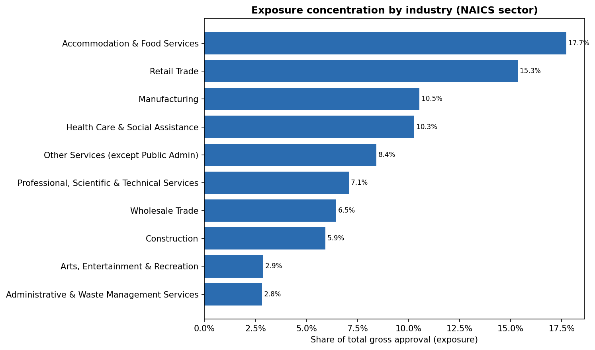

# Commercial Portfolio Monitoring — a working credit-risk monitoring programme on 1.09M real SBA small-business loans, mapped to APRA & Basel rules


**In one sentence:** when a bank lends to small businesses, the hard part isn't approving the
loan — it's everything *afterwards*: knowing what each loan really costs in losses, keeping
watch on whether the book stays healthy, and staying inside the limits the Board set. This
project builds that "keeping watch" system for **1.09 million real U.S. SBA 7(a) loans**
(FY2000–2019, ~$288B approved), and shows exactly how each piece meets the banking rules that
require it.

> Built on public SBA loan-level data as a **demonstration** — illustrative, **not a regulatory
> submission**. The same machinery works for any commercial loan book.

---

## Read this first (for any reader)

A bank's credit work has two halves:

1. **Origination** — deciding whether to approve a loan. *(Not this project.)*
2. **Monitoring** — watching the loans after the money is out the door: measuring the losses
   they actually produce, catching trouble early, and staying within the Board's limits.
   **That second half is what this project does.**

Regulators don't leave monitoring to chance — they require it to a defined standard. The
rulebooks this project maps to:

| Rulebook | Plain meaning |
|---|---|
| **APRA** (APS/APG 220, 113, 330) | Australia's banking regulator. **APS/APG 220** = credit-risk rules; **APS/APG 113** = extra rules for banks that use their own risk models (the "**IRB**" approach); **APS 330** = the public disclosure rules. |
| **Basel / IRB** (Basel Committee, "CRE36") | The global framework Australia's rules are built on. **IRB** = *Internal Ratings-Based* — a bank using its own PD/LGD/EAD models, which triggers tougher monitoring and validation duties. |

So "**how does this align with APRA and IRB?**" means: for each thing the project does, which
specific rule does it satisfy, and what did it find? That mapping is the whole point of the
README below.

**One thing that shapes everything here:** SBA FOIA data is *outcome-level* — one final status
per loan (paid off / charged off / in liquidation / …), with **no monthly payment feed** and
**no running balance**. So this project can't build a month-by-month transition matrix (its
sister mortgage monitor does that). What it *can* do — better than almost any other public
dataset — is read the **realised, through-the-cycle loss experience** straight off ~1.09M
finished loan outcomes that span the 2008 crisis. That realised loss experience is the
signature output: **the PD / LGD / EAD / Expected-Loss a deal is priced on and a provision is
set against.**

---

## The 10 jobs of a monitoring programme — what each does, the rule it meets, what it found

This is the heart of the project. Each row is one job; the sections after the table show the
evidence and charts.

| # | The job (plain English) | Rule it aligns with | Headline result |
|---|---|---|---|
| 1 | **Read the loss parameters** every price and provision needs (PD/LGD/EAD/EL) | APS 113 / APG 113; APG 220 ¶67(b) | PD **12.2%**, LGD **64%**, EAD **$265k**, **Expected Loss 4.9% (~$14.2B)** — broken down by sector, product and size |
| 2 | **Define "default" honestly** — and measure what's going bad *before* it's written off | APS 220 ¶33/79 | Non-performing **13.1%** vs charge-off **12.2%** — charge-off lags the 90+DPD/UTP reference default |
| 3 | **Price for the risk** — the loss curve by segment | APS 220 ¶35; APG 220 ¶79 | Small (<$50k) tickets lose **13.5%** per dollar; loans >$2m just **1.5%** — a ~9× pricing curve |
| 4 | **Track each year's lending ("vintage")** — is a whole cohort going bad faster? | APG 220 ¶67(c) | The **2007** crisis cohort charged off **28.8%** — ~**5×** the calm cohorts |
| 5 | **Watch concentration** — sector, geography, channel, single name | APS 220 ¶35/39 | Industry HHI **0.10** (amber); worst originating lender **46%** charge-off; single names immaterial (top names are franchise brands) |
| 6 | **Spot trouble early** — which exposures need attention *now*? | APS 220 ¶33; APG 220 ¶66 | A pre-charge-off pipeline (**$6.5B**) + early-warning segments (crisis small-loan clusters at ~**3×** the book) |
| 7 | **Set & police limits** — are we within what the Board agreed? | APS 220 ¶20/35; APG 220 ¶65 | **14** appetite limits, **appetite (amber) vs tolerance (red)**: **11 GREEN / 3 amber / 0 red** |
| 8 | **Stress test** — what happens in a downturn? | APS 220 ¶73/76 | A GFC replay roughly **triples** expected loss (4.9% → 15.3% → 17.6%) and pushes limits into RED |
| 9 | **Check the watchers** — is the monitoring itself any good? | APS 113 / APG 113 ¶140 | The early-warning signal is **predictive**: it ranks cohorts by eventual loss at **+0.87** rank correlation |
| 10 | **Feed public disclosure** — what goes into the Pillar 3 report? | APS 330 | Concentration & credit-quality tables produced in disclosure format |

> Everything is computed from the real data and assembled into one **[Board-style monitoring
> pack](outputs/reports/report.md)** — the single best file to read next.

---

## The results, walked through

### Job 1 — The loss parameters (the headline)

Every commercial deal is priced, and every provision is set, on four numbers. This project reads
all four straight off the realised outcomes of 1.09M finished loans:

| Parameter | Plain meaning | Value |
|---|---|--:|
| **PD** — probability of default | how often a loan goes bad | **12.2%** (obligor) · 7.7% ($-weighted) |
| **LGD** — loss given default | how much you lose when it does | **64%** gross · 17.2% net of the SBA guarantee |
| **EAD** — exposure at default | how much is on the line | **$264,769** average per loan |
| **EL** — expected loss | PD × LGD × EAD, the minimum loss margin a price must clear | **4.9%** of exposure (**~$14.2B** total) |

These reconcile exactly (`EL rate = PD($) × LGD`), and the crisis years are deliberately *inside*
the window, so they are genuine **through-the-cycle** anchors — the historical loss experience a
pricing or ECL/RWA model must be calibrated against. They are **observed**, not the output of a
fitted model (there is no scorecard here — that lives in the sister modelling repos).

*Aligns with: APS 113 / APG 113 (parameter inputs to capital/ECL — see the validation note in
[docs/governance.md](docs/governance.md)) and APG 220 ¶67(b) (provision coverage).*

### Job 2 — What does "default" really mean? (and what's hiding)

The headline PD counts **charge-offs** — a *realised, lagging* write-off. But APRA's reference
default is earlier (90+ days past due / unlikely-to-pay), so charge-off **understates** how many
loans have already breached. The monitor therefore also reports a **non-performing (NPL) proxy** —
charge-off *plus* the problem-exposure pipeline (delinquent / past-due / in-liquidation / guaranty
already purchased by the SBA):

| Measure | Rate | What it captures |
|---|--:|---|
| Charge-off (realised default) | 12.2% | loans already written off |
| **Non-performing (NPL proxy)** | **13.1%** | the closer 90+DPD/UTP measure — adds loans on the brink |

A loan where the SBA has already **purchased its guarantee** is an effective default awaiting
write-off — counting it as "performing" (the prior treatment) understated risk, so it now sits in
the non-performing layer.

*Aligns with: APS 220 ¶33/79 — identify problem and non-performing exposures early, not just at
write-off.*

### Job 3 — Price for the risk (the loss curve)

Loss is not evenly spread — it rides a steep curve by loan size, and shifts by product. A
risk-based price has to follow it:


| Loan size | Expected-loss rate |
|---|--:|
| ≤ $50k | **13.5%** |
| $50k–150k | 8.0% |
| $150k–350k | 6.1% |
| $350k–1m | 4.9% |
| $1m–2m | 4.2% |
| > $2m | **1.5%** |

Small tickets lose **~9×** what the largest loans do. By **product**, a revolving working-capital
line is riskiest per dollar (EL **9.4%**, LGD **87%** — drawn toward the limit at default), while
property-secured lending is safest (EL **1.9%**). By **sector**, expected loss varies ~9× — highest
in Construction (6.8%), lowest in Health Care (3.0%):


*Aligns with: APS 220 ¶35 (higher-risk products & segments) and APG 220 ¶79 (price for the
additional risk).*

### Job 4 — Is a whole year's lending going bad? (the standout story)

Line each approval year up and watch how fast its loans charge off. The 2006–08 loans were written
straight into the financial crisis; the 2012–15 loans into calm markets. The cohorts separate hard:


| Approval year | Charge-off rate | |
|---|--:|---|
| 2007 | **28.8%** | crisis peak |
| 2006 | 24.3% | crisis |
| 2008 | 24.2% | crisis |
| 2012–15 | ~5–6% | calm |

The 2007 cohort charged off at **~5× the calm-year cohorts** — the clearest possible demonstration
of why you track lending year-by-year. The cumulative cohort curves show the same split as the
loans age:


*Aligns with: APG 220 ¶67(c) — track credit migration across the portfolio.*

### Job 5 — Are we over-exposed to any one thing?

Concentration is a risk in its own right — a single shock hurts more if the book is bunched up.
The monitor checks it four ways:



- **Industry** — the only dimension that registers: HHI **0.10** ("Moderate", and the one amber
  concentration flag); the top sector (Accommodation & Food Services) is **17.7%** of exposure.
- **Geography** — top state is **17%** of the book; diversification is "Low".
- **Originating channel** — SBA loans are written by ~4,200 lenders. **Originator performance**
  oversight surfaces the standout finding: the worst material originating lender charged off at
  **46%**, versus a ~12% book average — exactly the third-party-originator risk APRA wants seen.
- **Single borrowers** — immaterial by share (top-20 ≈ **0.4%**), because the book is >900k
  distinct borrowers — but the largest names are **franchise brands** (SUBWAY, DUNKIN DONUTS,
  DAYS INN…), i.e. correlated-obligor clusters, now made visible.

*Aligns with: APS 220 ¶35 (industry/geography/single-name limits) and ¶39 (third-party
originators).*

### Job 6 — Which exposures need attention now?

Because the data has no monthly arrears feed, the early-warning view works two ways:

- a **problem-exposure pipeline** — **$6.5B** (2.3% of exposure; 0.9% of loans) sitting in
  delinquent / past-due / in-liquidation / guaranty-purchased states *before* a formal charge-off; and
- **early-warning segments** — which **industry × vintage × size** pockets charged off well above
  the book average (worst: Real-Estate 2007 sub-$50k loans at **42%**, ~3× the book).

These feed a 3-stage IFRS 9-style proxy — **Stage 1 performing (90.0%) / Stage 2 problem
exposure (2.3%) / Stage 3 charged off (7.7%)** — so near-certain-loss loans are no longer hidden
inside "performing".

*Aligns with: APS 220 ¶33 (early identification) and APG 220 ¶66 (forward-looking indicators, not
just lagging arrears).*

### Job 7 — Are we within the Board's limits?

Monitoring without limits is just reporting. The project carries a **risk-appetite statement**:
for each metric, an **amber** (early-warning / "appetite") level and a **red** (hard limit /
"tolerance") level, plus who owns it and what they do if it's breached. The Board reads the
**colour**, not the table.

The register runs to **14 limits** — industry / geography / single-name / originating-channel
concentration, higher-risk products, growth, the dollar expected-loss rate, the NPL ratio and the
charge-off rate. Today: **11 GREEN, 3 amber, 0 red**. The three ambers are the industry-HHI flag
(a marginal cross, inside its tolerance band), the NPL ratio (13.1% vs a 13.0% appetite) and the
charge-off rate (13.5% vs 12.0%) — all reflecting that SBA 7(a) is genuinely higher-loss SME
lending. The limits live in a plain config file, so a risk owner can change appetite without
touching any code.

*Aligns with: APS 220 ¶20 (appetite vs tolerance) & ¶35 (limits); APG 220 ¶65 (Board dashboard).*

### Job 8 — What happens in a downturn?

The monitor runs a graded **stress ladder** off the crisis cohorts the data already contains, and
re-tests each scenario against **two** appetite limits — the charge-off rate *and* the dollar
expected-loss rate (so stressed severity is bounded, not just the headline count):


| Scenario | Charge-off rate | Expected-loss rate |
|---|--:|--:|
| Baseline (today) | 13.5% | 4.9% |
| Adverse — historical crisis replay | 26.0% | 15.3% |
| Severe — worst observed vintage (2007) | 28.8% | 17.6% |
| Hypothetical management overlay | 36.0% | 21.9% |

Expected loss roughly **triples** in the downturn and every stressed scenario breaches appetite —
exactly the early warning a Board needs *before* a downturn arrives, so limits and lending can be
tightened in time.

*Aligns with: APS 220 ¶73 (stress feeds limits) & ¶76 (stress models must be validated).*

### Job 9 — Is the monitoring itself any good?

A monitoring metric is only worth having if it actually **predicts** trouble. The project tests its
leading indicators against the realised outcomes the data already holds: across seasoned cohorts,
the **early-MOB charge-off rate** (how a cohort is failing at 24 months) ranks cohorts by their
*eventual* loss at a **+0.87** rank correlation — confirmed predictive. The origination-mix signals
score weak, and are reported honestly as such rather than assumed to work.

*Aligns with: APS 113 / APG 113 ¶140 (8-element validation of the framework, including the
"performance / predictiveness" element) — see [docs/governance.md](docs/governance.md).*

### Job 10 — Feeding public disclosure

The concentration and credit-quality-by-industry outputs are laid out in the format that feeds a
bank's public **Pillar 3** disclosure (APS 330) — format only, illustrative, not a regulated
entity's disclosure.

---

## Where the IRB (internal-models) rules come in specifically

"IRB" is the regime for banks that use their own PD/LGD/EAD models — it carries extra monitoring
and validation duties. This project touches them at these points:

| IRB / Basel duty | Rule | Where in this project |
|---|---|---|
| Parameter inputs (PD/LGD/EAD) for capital/ECL | APS 113 Att. D | Job 1 + parameter-validation note in [docs/governance.md](docs/governance.md) |
| Validate the framework (8 elements) | APG 113 ¶140 | The predictiveness test (Job 9) + [docs/governance.md](docs/governance.md) |
| Independent monitoring unit (separate from origination) | Basel CRE36.57 | Reporting line documented in [docs/governance.md](docs/governance.md) |
| Daily monitoring of facility amounts/limits | APS 113 Att.D ¶6; CRE36.92 | Documented as a live-deployment requirement (batch demonstrator here) |
| Downturn parameters | APS 220 ¶73/76 | The stress ladder (Job 8) |

This project does the portfolio **monitoring**; the sister repos do the actual **modelling**
(PD/LGD/EAD scorecards, IFRS 9 staging). A full gap-by-gap compliance map — every APRA/Basel
requirement, what was found, and how each gap was closed — is in
**[docs/compliance_gap_review.md](docs/compliance_gap_review.md)**.

---

## Honest limitations

- A **demonstration**, not a production or regulatory-capital system. Disclosure-style tables are
  **format only**.
- **Outcome-level** data: one final status per loan, no monthly balance or arrears feed — so there
  is **no true monthly transition matrix or IFRS 9 staging** here (only a coarse 3-stage proxy).
  Full staging and transition matrices live in the companion **Freddie Mac mortgage monitor**.
- **Default = charge-off** (lagging); the NPL proxy is the closer reference-default measure but is
  still not a literal 90+DPD figure.
- The PD/LGD/EAD/EL are **realised, extracted anchors**, not a fitted model — and SBA 7(a) is small,
  often unsecured, **government-guaranteed** SME lending, so they are an anchor to reason from, not
  a drop-in calibration for a different book.
- **EAD = gross approval** (no running balance), which ignores the credit-conversion factor on
  undrawn revolving limits.
- Risk-appetite limits, the net-of-guarantee LGD and the stress overlay are **illustrative demo
  values**, not fitted to this sample.

---

## How it's built (for a technical reader)

Plain Python (pandas + matplotlib), fully reproducible. Business parameters live in one config
file; `src/` modules each do one job; the pipeline orchestrates them into the result tables,
charts and the Board pack. Every committed number regenerates with no manual steps.

```
config.yaml              # universe, size bands, products, the 14 appetite limits, stress scenarios
src/
  data_loader.py         # read + clean the SBA CSVs (dates, status codes, NAICS → sector, data quality)
  base_table.py          # one row per loan + derived fields (vintage, size, product, default & NPL flags)
  credit_parameters.py   # realised PD / LGD / EAD / EL — overall, by sector / product / size / structure + stress
  concentration.py       # HHI + top-N by industry / state / lender / borrower; originator performance
  chargeoff.py · vintage.py · transitions.py   # charge-off rates, cohort curves, loan-age view
  early_warning.py · problem_exposure.py        # elevated-risk segments + the pre-charge-off pipeline
  risk_appetite.py       # the 14-limit register, appetite vs tolerance, RAG dashboard + actions
  leading.py · validation.py   # leading-vs-lagging views + the predictiveness backtest
  stress.py              # 4-scenario stress ladder tested against the charge-off & $-EL limits
  report.py · charts.py · pipeline.py           # assemble the pack, figures, and orchestrate everything
notebooks/00–05          # the ordered build, each with a plain-English summary and one results table
outputs/                 # committed snapshots: tables/, charts/, reports/report.md
docs/                    # compliance_gap_review.md · governance.md · methodology.md · assumptions.md
tests/                   # fast unit tests on a synthetic fixture (no raw data needed)
```

```bash
pip install -r requirements.txt
# Download the 7(a) FOIA CSVs from data.sba.gov and drop them in data/input/
python -m src.run_pipeline      # → outputs/tables + outputs/reports/report.md
python tools/make_figures.py    # → outputs/charts/*.png
pytest                          # fast tests on a synthetic fixture
```

**Data & provenance:** U.S. Small Business Administration **7(a) FOIA** loan-level dataset
([data.sba.gov](https://data.sba.gov)), approval FY2000–2019 — public domain. The large raw CSVs
are **gitignored**; only aggregated output snapshots, charts and the report are committed. The
504 dataset can be added with no code change (any `foia-7a-*.csv` in `data/input/` is picked up).

---

## Related projects

- **Freddie Mac mortgage monitor** / **mortgage-portfolio-monitoring** — the same monitoring
  discipline on a *monthly* mortgage panel: full IFRS 9 staging, transition matrices, roll rates,
  and fitted PD models (the model-performance / backtesting layer this repo defers to).
- **Scorecard PD/EAD (consumer credit)** — PD/EAD scorecard development & validation.

The natural pairing: those projects **model** the portfolio (PD/LGD/EAD); this one **reads the
realised loss experience and monitors the book** over the cycle.

## License

Released under the MIT License — free to read, run, and reuse with attribution.
