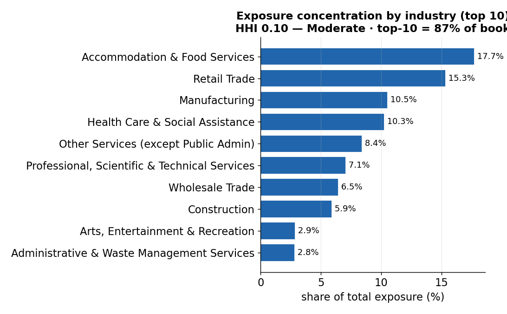
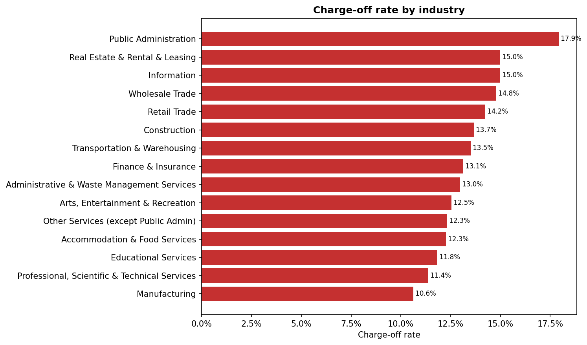

# Commercial Portfolio Monitor — SBA 7(a) real data

> Extracts **realised PD, LGD, EAD and expected loss** from ~1.09M real U.S. SBA
> 7(a) small-business loans (FY2000–2019, ~$288B approved) and turns them into
> **deal-pricing and risk-management assumption inputs** — alongside
> concentration, charge-off and vintage-cohort monitoring on the same book.

This project answers one question end-to-end: *after the data extraction, what
are the average PD, LGD, EAD and expected loss of this commercial book?* Those
four parameters are the loss-experience anchors a credit deal is priced on and a
provision (ECL) / capital (RWA) calculation is calibrated against. They are
**observed, through-the-cycle** values read straight off loan outcomes — the
FY2000–2019 window deliberately spans the 2008 crisis, so the averages are
genuinely through-the-cycle rather than a benign-period snapshot.

It is deliberately simple and interpretable — pandas aggregations, clear
definitions, one results table per step — and every number below is committed
real output that reconciles by the identity **EL rate = PD($) × LGD**.

---

## 📌 Headline — average credit-risk parameters (FY2000–2019)

The four assumption inputs for deal pricing and risk management, averaged across
the whole funded book (real output — [09_credit_risk_parameters.csv](outputs/tables/09_credit_risk_parameters.csv)):

| Parameter | Portfolio average | Basis |
|---|---:|---|
| **PD** — probability of default (obligor-weighted) | **12.2%** | charged-off loans ÷ funded loans |
| **PD** — exposure-weighted ($) | **7.7%** | defaulted EAD ÷ total EAD |
| **LGD** — loss given default (gross / whole-loan) | **64.0%** | charge-off $ ÷ defaulted EAD |
| **LGD** — net of SBA guarantee (lender-retained, indicative) | **17.2%** | LGD × (1 − guaranteed share) |
| **EAD** — exposure at default (avg per loan) | **$264,769** | gross approval |
| **EAD** — avg per *defaulted* loan | **$166,828** | gross approval of defaulters |
| **Expected loss rate** — EL ÷ exposure | **4.9%** | PD($) × LGD = charge-off $ ÷ total EAD |
| **Expected loss per loan** (avg) | **$13,032** | charge-off $ ÷ funded loans |
| _SBA guaranteed share (context)_ | _73.2%_ | guaranteed $ ÷ gross approval |

> **Why two PDs and two EADs?** Defaulters skew *smaller* than the average loan,
> so the obligor-weighted PD (12.2%) must be paired with the **defaulted-loan**
> EAD (~$167k), while the exposure-weighted PD (7.7%) pairs with the
> book-average EAD. The clean, internally consistent expected-loss identity is
> **EL rate = PD($) × LGD = 7.7% × 64.0% ≈ 4.9%**, i.e. ~$14.2B of realised
> loss on $287.8B of approvals.

### By product (facility type)

> **Which products exist here — and which don't.** This is **small-business
> (SME) lending throughout**. The data has **no residential mortgage** product
> and **no labelled commercial-property** field. "Product" below is a
> *use-of-proceeds facility type* derived from the fields that *are* present —
> export subprogram (→ trade finance), the revolving flag (→ working-capital
> line), and loan **term** (only real estate carries SBA maturities beyond ~15y,
> so long-dated term loans are a **commercial-property proxy**). Residential/
> commercial-property *mortgage* books live in the sister residential-mortgage /
> Freddie Mac repos and SBA's separate **504** program — not in this 7(a) build.

([09_…by_product.csv](outputs/tables/09_credit_risk_parameters_by_product.csv))

| Product (facility type) | Loans | PD (count) | LGD | Avg EAD | **EL rate** |
|---|---:|---:|---:|---:|---:|
| Commercial property / real-estate term loan *(proxy: term >15y)* | 144,669 | 3.7% | 52.9% | $875,305 | **1.9%** |
| Trade & export finance | 7,500 | 11.2% | 60.4% | $936,121 | **4.6%** |
| General SME term loan | 615,115 | 13.1% | 64.2% | $217,619 | **7.1%** |
| Working-capital line (revolving) | 319,735 | 14.5% | 87.0% | $63,483 | **9.4%** |

The ranking is exactly what a credit officer expects: **property-secured**
lending is the safest (EL 1.9% — long-dated, real-estate collateral, big
tickets), while a **revolving working-capital line** is the riskiest per dollar
(EL 9.4%, **LGD 87%** — drawn toward the limit at default). That ~5× spread in
EL rate is what a risk-based price has to reflect across products.

### Secured (PPSR-registered) vs unsecured, and term vs revolving

Two further pricing cuts. *Secured* = the loan carries registered collateral —
the SBA equivalent of a **PPSR-registered** security interest
([09_…by_structure.csv](outputs/tables/09_credit_risk_parameters_by_structure.csv)):

| Cut | Segment | Loans | PD (count) | LGD | Avg EAD | **EL rate** |
|---|---|---:|---:|---:|---:|---:|
| Collateral | **Secured (PPSR-equivalent)** | 436,969 | 8.8% | 62.9% | $410,653 | **3.4%** |
| Collateral | Unsecured | 650,050 | 14.5% | 64.8% | $166,705 | **7.5%** |
| Loan structure | Term loan | 765,589 | 11.3% | 61.4% | $346,313 | **4.6%** |
| Loan structure | Revolving line of credit | 321,430 | 14.4% | 86.9% | $70,545 | **8.6%** |

**Secured (collateralised) SME loans lose ~2× less** than unsecured (EL 3.4% vs
7.5%) — the value of taking registered security — and revolving lines carry a
far higher **LGD** (86.9% vs 61.4%) than term loans.

### Risk-based parameters by loan-size band — the pricing curve

Pricing is risk-based, so the averages are most useful **segmented**. Small
tickets default ~5× more often *and* lose more per dollar — this is the curve a
risk-based price has to ride ([09_…by_size_band.csv](outputs/tables/09_credit_risk_parameters_by_size_band.csv)):

| Size band | Loans | PD (count) | LGD | Avg EAD | **EL rate** |
|---|---:|---:|---:|---:|---:|
| ≤ $50k | 458,365 | 16.1% | 83.3% | $27,372 | **13.5%** |
| $50k–150k | 260,397 | 11.0% | 72.9% | $103,701 | **8.0%** |
| $150k–350k | 163,918 | 9.1% | 66.9% | $251,442 | **6.1%** |
| $350k–1m | 137,852 | 8.2% | 60.3% | $602,830 | **4.9%** |
| $1m–2m | 49,362 | 7.3% | 57.4% | $1,429,610 | **4.2%** |
| > $2m | 17,125 | 2.9% | 52.5% | $3,116,693 | **1.5%** |

A per-industry breakdown is in [09_…by_industry.csv](outputs/tables/09_credit_risk_parameters_by_industry.csv).

### Using these as pricing & risk inputs

- **Deal pricing (expected-loss spread).** The EL rate is the minimum margin a
  deal must clear *before* funding cost, opex and a capital charge — e.g. a ≤$50k
  facility needs a ~13.5% loss buffer, a >$2m facility ~1.5%. Plug PD($)×LGD per
  segment into a RAROC / risk-based-pricing model as the loss component.
- **Provisioning (ECL).** PD × LGD × EAD is the expected-credit-loss building
  block; the through-the-cycle averages here are the historical anchor a
  point-in-time, forward-looking ECL is overlaid on.
- **Stress / capital.** The crisis vintages (2006–08) charged off at ~24–29%
  (vs ~5% in calm years) — a ~1.9× through-the-cycle multiplier, applied in the
  [stress scenario](outputs/tables/08_stress_scenario.csv), gives a downturn-LGD /
  stressed-PD view for capital and limit-setting.

> **Scope honesty.** These are *realised, extracted* parameters — **not** a
> fitted obligor-level rating model. There is no scorecard and no PD prediction
> here, so there is no model-performance / backtesting layer; that lives in the
> sister modelling repos. What this repo gives a pricing or provisioning model
> is the loss-experience it must be calibrated against.

---

## See it in 30 seconds

No download or run needed — everything below is committed real output:

- 📄 **[Monitoring pack report](outputs/reports/report.md)** — credit-committee summary; **§10 is the PD/LGD/EAD/EL parameter block.**
- 📋 **[Credit-risk parameters](outputs/tables/09_credit_risk_parameters.csv)** — the headline table, plus [by product](outputs/tables/09_credit_risk_parameters_by_product.csv), [by structure](outputs/tables/09_credit_risk_parameters_by_structure.csv), [by size band](outputs/tables/09_credit_risk_parameters_by_size_band.csv) and [by industry](outputs/tables/09_credit_risk_parameters_by_industry.csv).
- 📊 **[Charts](outputs/charts/)** — concentration, charge-off, vintage cohort curves.
- 📓 **Notebooks** — [00 Load & clean](notebooks/00_load_and_clean.ipynb) ·
  [01 Base table](notebooks/01_monitoring_base_table.ipynb) ·
  [02 Concentration](notebooks/02_concentration.ipynb) ·
  [03 Charge-off & vintage](notebooks/03_chargeoff_and_vintage.ipynb) ·
  [04 Transitions & early warning](notebooks/04_transitions_and_early_warning.ipynb) ·
  [05 Report](notebooks/05_monitoring_report.ipynb)

To reproduce locally:

```bash
pip install -r requirements.txt
# place the SBA 7(a) FOIA CSVs in data/input/  (see Data sources & provenance)
python -m src.run_pipeline          # writes outputs/tables, outputs/charts, outputs/reports/report.md
python -m src.build_notebooks       # (optional) rebuild + execute notebooks 00–05
pytest                              # fast unit tests on a synthetic fixture
```

---

## How the parameters are defined

All four reuse the same primitives as the charge-off and stage-proxy tables, so
they reconcile exactly. SBA FOIA data is outcome-level (one final status per
loan), with no amortising balance — so exposure is measured at approval.

| Parameter | Definition used here | Note |
|---|---|---|
| **PD** | `default = LoanStatus == CHGOFF`; rate = charged-off ÷ total | A *lagging, realised* default (charge-off), not the APS 220 90+DPD/UTP reference — so it **understates** how many loans ever breached. |
| **LGD** | charge-off $ (`grosschargeoffamount`) ÷ exposure of defaulted loans | Gross / whole-loan. Net-of-guarantee LGD applies the ~73% SBA guaranteed share and is **indicative** (the guarantee covers the guaranteed portion of each loss). |
| **EAD** | `grossapproval` (amount approved) | No running balance in SBA data, so origination exposure is the EAD proxy — it slightly *overstates* balance at default for amortised loans. |
| **EL** | PD × LGD × EAD ( = realised charge-off $ ) | EL rate = charge-off $ ÷ total exposure = the dollar charge-off rate. |

Full assumptions and limitations: [docs/assumptions.md](docs/assumptions.md) ·
methodology: [docs/methodology.md](docs/methodology.md).

---

## How this maps to the APRA / Basel framework

> Portfolio **monitoring + parameter-extraction** demonstration on public SBA data — not a regulatory
> submission. It shows the methods and framework awareness; operational items (use test, Board reporting,
> daily monitoring) are noted as production intent. The parameters are *realised* anchors, not a fitted
> rating model, so the model-performance/backtesting layer stays out of scope (see the sister modelling repos).

| Framework requirement | Where / how it's evidenced here |
|---|---|
| Default definition (APS 220: 90+ DPD / UTP) | `default = charge-off` (CHGOFF), labelled a **lagging** write-off point vs the 90+DPD/UTP reference; a pre-charge-off **problem-exposure / early-warning** layer (DELINQ / PSTDUE / IN LIQUIDATION) sits ahead of it — [src/problem_exposure.py](src/problem_exposure.py), nb 04 |
| Risk parameters (PD / LGD / EAD / EL) | **realised** PD/LGD/EAD/EL extracted as pricing & ECL calibration inputs, overall + by size band + by industry — [src/credit_parameters.py](src/credit_parameters.py), report §10. **No fitted rating model here → model-performance (backtesting) is N/A**; see the sister modelling repos |
| Concentration limits (APS 220 para 35) | HHI + top-N by **industry / state / single-lender (top-20)**, tied to the appetite limits — [src/concentration.py](src/concentration.py), nb 02 |
| Risk appetite + limits (APS 220 para 20/35) | config-driven appetite table — amber/red, owner, breach action, review cycle — [config.yaml](config.yaml), [src/risk_appetite.py](src/risk_appetite.py) |
| Board MI / RAG dashboard (APG 220 para 65) | the pack opens with a `metric \| value \| limit \| RAG` dashboard + an actions table for amber/red items — [src/report.py](src/report.py), [outputs/reports/report.md](outputs/reports/report.md) |
| Leading vs lagging (APG 220 para 66) | every metric labelled; origination-mix trend + vintage-over-vintage early-MOB leading views — [src/leading.py](src/leading.py), nb 03 |
| Charge-off & vintage cohort analytics | charge-off by industry / size / vintage + cumulative cohort curves — [src/chargeoff.py](src/chargeoff.py), [src/vintage.py](src/vintage.py), nb 03 |
| Stress → limits (APS 220 para 73) | a crisis-era charge-off multiplier (the 2006–08 cohorts) re-tested against the appetite limits — [src/stress.py](src/stress.py) |
| Independent validation (APS 220 paras 75–76) | the monitoring framework would be independently validated annually — [docs/governance.md](docs/governance.md) |
| Pillar 3 (APS 330) | the concentration / credit-quality outputs feed an **APS 330-style** credit-quality table — **format only**, not a regulatory disclosure — [src/report.py](src/report.py) |
| Out of scope (by design) | monthly transition matrices, IFRS 9 staging, ECL run-out — SBA data is outcome-level; these live in the **Freddie Mac monitor** |

---

## What else this produces

**Portfolio at a glance (real output, FY2000–2019):**

| Metric | Value |
|---|---|
| Funded 7(a) loans | 1,087,019 |
| Total gross approval | $287.8B |
| Charge-off rate (by count / by $) | 12.2% / 4.9% |
| Total realised loss (expected-loss anchor) | ~$14.2B |
| Industry concentration (HHI) | 0.10 — *Moderate* |
| State / lender concentration (HHI) | 0.06 / 0.01 — *Low* |

### Key charts

*All charts are regenerated from the committed result tables in [outputs/tables/](outputs/tables/)
by [tools/make_figures.py](tools/make_figures.py) — aggregated portfolio metrics only.*

#### 1. Charge-off rate by approval-year vintage (the PD through the cycle)


**What this shows:** the eventual charge-off rate (realised PD) of each origination-year cohort; grey points are recent vintages not yet fully seasoned.
**Why it matters:** the 2005–2008 crisis-origination cohorts charged off at ~24–29%, roughly **5× the calm-year cohorts** — the spread between the through-the-cycle PD used for pricing and the stressed PD used for capital.

#### 2. Exposure concentration by industry


**What this shows:** the ten industries holding the most exposure, with the portfolio's industry concentration (HHI) and top-10 share.
**Why it matters:** concentration is itself a risk — an HHI of 0.10 (Moderate) with the top-10 holding ~87% says where a sector shock would land.

#### 3. Charge-off rate by industry


**What this shows:** the industries with the highest charge-off rates by loan count.
**Why it matters:** read with concentration, it flags where high exposure meets high loss rate — the segments to watch and price for.

Other outputs (all in [`outputs/`](outputs/)):

- **Credit-risk parameters** — PD / LGD / EAD / EL overall, by size band, by industry (the pricing/ECL inputs above).
- **Concentration** — exposure & count by industry (NAICS sector), state, and lender, each with top-N share and HHI.
- **Charge-off rates** — by industry, loan-size band, and vintage.
- **Loan-age transition view** — *when* charge-offs occur, by loan age.
- **Early-warning segments** — industry × vintage × size buckets charging off ≥1.5× the portfolio average.
- **Stage proxy** — coarse performing-vs-defaulted split, plus an *APS 330-style* credit-quality table (format only).

### Key definitions

- **Default = charge-off** (`LoanStatus == CHGOFF`). Performing = paid in full or current.
- **Charge-off rate** = charged-off count (or $) ÷ total in the segment.
- **Vintage** = approval-year cohort.
- **HHI (Herfindahl–Hirschman Index)** = sum of squared segment shares; 0 = diversified, 1.0 = fully concentrated.

---

## Repo layout

```
config.yaml              business parameters (universe, size bands, HHI bounds, early-warning rules)
src/
  data_loader.py         read + clean the SBA CSVs (dates, status codes, NAICS → sector)
  base_table.py          one row per loan + derived fields (vintage, size band, default flag, age)
  credit_parameters.py   realised PD / LGD / EAD / EL — overall, by size band, by industry
  concentration.py       HHI + top-N by industry / state / lender
  chargeoff.py           charge-off rates by industry / size band / vintage
  vintage.py             cumulative charge-off cohort curves (vintage × months-on-book)
  transitions.py         loan-age transition view
  early_warning.py       elevated-risk segment flags
  problem_exposure.py    pre-charge-off problem-exposure layer (DELINQ/PSTDUE/LIQUID)
  risk_appetite.py       appetite + limit framework, RAG dashboard, actions (governance)
  leading.py             leading-vs-lagging map, origination mix trend, vintage-over-vintage early-MOB
  stress.py              crisis-multiplier stress scenario tested against the limits
  report.py              stage proxy, APS 330-style table, board RAG dashboard, PD/LGD/EAD/EL block, Markdown pack
  charts.py              matplotlib chart helpers
  pipeline.py            orchestrates everything → outputs/
  run_pipeline.py        CLI entry point (python -m src.run_pipeline)
  build_notebooks.py     (re)generate + execute notebooks 00–05
tools/make_figures.py    regenerate README charts into outputs/charts/
notebooks/               00–05, each with a plain-English summary + one results table
outputs/                 committed snapshots: tables/ (incl. 09_credit_risk_parameters*), charts/, reports/
docs/                    data dictionary, methodology, assumptions, governance
tests/                   fast unit tests on a synthetic fixture (no raw data needed)
```

---

## Data sources & provenance

- **Source:** U.S. Small Business Administration open data ([data.sba.gov](https://data.sba.gov)) —
  the **7(a) FOIA** loan-level dataset (CSV).
- **Files used:** `foia-7a-fy2000-fy2009-*.csv` and `foia-7a-fy2010-fy2019-*.csv`
  (approval fiscal years 2000–2019), plus the official data dictionary.
- **Compliance:** SBA FOIA data is public / U.S. Government and free to use. The
  large raw CSVs are **gitignored** — download them yourself and drop them in
  `data/input/`. Only small output snapshots, charts, and the report are committed.
- **Scope note:** this build uses the 7(a) program. The 504 FOIA dataset can be
  added with no code change — any `foia-7a-*.csv` (or sibling) file in
  `data/input/` is picked up automatically by the loader.

---

## Related projects

- **Freddie Mac mortgage monitor** — the companion repo for full IFRS 9 staging,
  monthly **transition matrices**, roll rates and ECL run-out on a monthly
  performance panel, plus *fitted* PD models (where the model-performance /
  backtesting layer lives).
- **Residential mortgage credit-risk repo** — loan-level mortgage default
  modelling on public data (consumer counterpart to this commercial book).

Together they cover **commercial** (this repo) and **residential/mortgage**
portfolio monitoring on real, public data.

---

_Built with pandas + matplotlib. Monitoring + parameter-extraction outputs only —
not regulated disclosure or credit advice._

## License

Released under the MIT License — free to read, run, and reuse with attribution.
